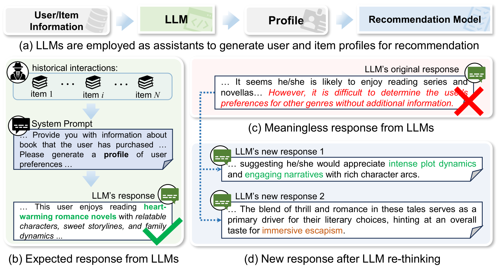
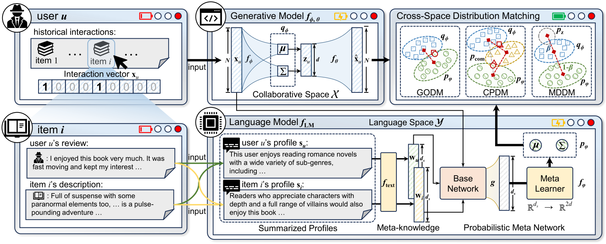
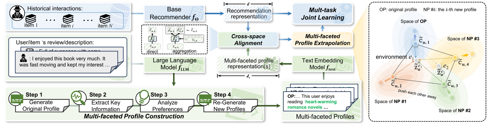
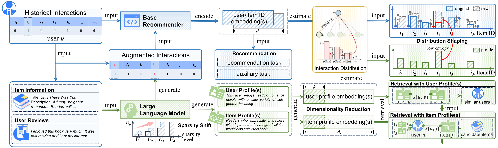

# ProRec
**LLM-derived Profiling for Recommendation (ProRec)**
<p float="left">  <br>

In recent years, pre-trained Large Language Models (LLMs) have demonstrated remarkable generalization ability for recommender systems. The first line of work involves fine-tuning LLMs to serve as holistic recommendation models; however, this approach incurs high computational costs and often suffers from poor generalization across diverse recommendation scenarios. An alternative strategy treats LLMs as plug-and-play enhancement modules, improving base recommender models by incorporating rich semantic priors. As illustrated in the figure (a), to exploit their advantages in text understanding and generation, LLMs are used to encode user interactions and auxiliary information into compact representations (e.g., **user or item profiles**). 

<p align="center">

</p>

As illustrated in the figure (b), the objective of user profiling is to leverage LLMs to construct high-quality user profiles that capture user preferences for downstream recommendation tasks. However, when user–item interactions are highly sparse or exhibit complex patterns, one-shot profiling often produces unreliable or even meaningless results (as shown in figure (c)). Such profiles may misrepresent user interests and introduce noise during training, thereby hindering subsequent recommendation performance.

Based on this, **ProRec** builds upon prior research works such as KAR and RLMRec to conduct a more fine-grained investigation of the aforementioned issues.
Specifically, ProRec is an integrated recommendation model library that encompasses our latest research advances in LLM-based user profiling for recommendation. It covers how to construct user profiles, how to align them with different types of recommendation models, and how to maximize the utilization of their semantic information. Currently, ProRec provides three recommendation models: **DMRec (SIGIR'25)**, **ProEx (KDD'26)**, and **ProMax (SIGIR'26)**. ProRec is still under active development and undergoing continuous refinement. Please stay tuned.

## 📝 Environment (based on our test platform)
```
python == 3.8.18
pytorch == 2.1.0 (cuda:12.1)
scipy == 1.10.1
numpy == 1.24.3
tdqm == 4.65.0
```
> For some special models, additional third-party libraries may be required.

## 📝 Examples to Run 

### DMRec

> Yi Zhang, Yiwen Zhang*, Yu Wang, Tong Chen, and Hongzhi Yin*. 2025. [Towards Distribution Matching between Collaborative and Language Spaces for Generative Recommendation](https://arxiv.org/abs/2504.07363). In Proceedings of the 48th International ACM SIGIR Conference on Research and Development in Information Retrieval (SIGIR’25).

<p align="center">

</p>

To run DMRec, you first need to download the preprocessed user and item profile representations ([Google Drive](https://drive.google.com/drive/folders/1_fCatrlFgBVTmPFFi-dwFCopElQQX70w?usp=sharing)). DMRec is a recommendation framework, which means you need to define the base model to be run, and then select three matching strategies (GODM, CPDM, and MDDM). The following are examples:

- Global Optimality for Distribution Matching:

  `python train_encoder.py --model {model_name}_godm --dataset {dataset} --cuda 0`
  
- Composite Prior for Distribution Matching:

  `python train_encoder.py --model {model_name}_cpdm --dataset {dataset} --cuda 0`
  
- Mixing Divergence for Distribution Matching:

  `python train_encoder.py --model {model_name}_mddm --dataset {dataset} --cuda 0`

The hyperparameters of each model are stored in `encoder/config/modelconf`. The most important hyperparameter is the trade-off coefficient `beta`, and the other hyperparameters can be set by default. It should be noted that the base model of DMRec must be a generative model (e.g., VAE). Therefore, in the configuration file, the `type` must be specified as `generative`. The `save/log` folder provides training logs for reference. The results of a single experiment may differ slightly from those given in the paper because they were run several times and averaged in the experiment.

### ProEx

> Yi Zhang, Yiwen Zhang*, Yu Wang, Tong Chen, Hongzhi Yin*. 2025. [ProEx: A Unified Framework Leveraging Large Language Model with Profile Extrapolation for Recommendation](https://arxiv.org/abs/2512.00679). The 32nd SIGKDD Conference on Knowledge Discovery and Data Mining (KDD’26).

<p align="center">

</p>

ProEx introduces three additional profiles based on Chain-of-Thought reasoning on top of the original user or item profile. Therefore, to run ProEx, in addition to downloading the original profiles ([Google Drive](https://drive.google.com/drive/folders/1_fCatrlFgBVTmPFFi-dwFCopElQQX70w?usp=sharing)), it is also necessary to download the corresponding new profiles ([Google Drive](https://drive.google.com/drive/folders/1x7TAiY2zYFrtPcNuzV3jrdiCO5rokuqd?usp=sharing)). Both the original and new profiles must be placed in dataset folders with the same name. Unlike DMRec, ProEx can be applied to both discriminative models (e.g., LightGCN) and generative models (e.g., Mult-VAE). Therefore, in the configuration file, the `type` must be specified as `generative` for generative models; and the `type` must be specified as `discriminative` for discriminative models. The following are examples of runs on three datasets:

- `python train_encoder.py --model {model_name}_proex --dataset {dataset} --cuda 0`

The hyperparameters of each model are stored in `encoder/config/modelconf`. The most important hyperparameters are the number of environments `num_envs` and the weight `ex_weight`, and the other hyperparameters can be set by default. The `save/log` folder provides training logs for reference. The results of a single experiment may differ slightly from those given in the paper because they were run several times and averaged in the experiment.

### ProMax

> Yi Zhang, Yiwen Zhang*, Kai Zheng, Tong Chen, Hongzhi Yin*. 2025. [ProMax: Exploring the Potential of LLM-derived Profiles with Distribution Shaping for Recommender Systems](https://arxiv.org/abs/2604.26231). The 32nd SIGKDD Conference on Knowledge Discovery and Data Mining (KDD’26).

<p align="center">

</p>

ProMax aims to fully exploit the information in the original profiles. It constructs new latent interactions for each user through profile-based retrieval. Therefore, for each dataset in `data`, in addition to the original training set `trn_mat.pkl`, a new interaction file `new_trn_rag_mat.pkl` generated via LLM-based re-ranking is also required. Similar to DMRec and ProEx, to run ProMax, the original profiles ([Google Drive](https://drive.google.com/drive/folders/1_fCatrlFgBVTmPFFi-dwFCopElQQX70w?usp=sharing)) must first be downloaded and placed in the dataset folder with the same name. Currently, ProMax is only applicable to discriminative models (e.g., LightGCN). Therefore, in the configuration file, the `type` must be specified as `discriminative` for discriminative models. The following are examples of runs on three datasets:

- `python train_encoder.py --model {model_name}_promax --dataset {dataset} --cuda 0`

The hyperparameters of each model are stored in `encoder/config/modelconf`. The most important hyperparameters are the weights `sdr_weight` and `s2dr_weight`, and the other hyperparameters can be set by default. The `save/log` folder provides training logs for reference. The results of a single experiment may differ slightly from those given in the paper because they were run several times and averaged in the experiment.

## 📝 Acknowledgement
To maintain fair comparisons and consistency, the model training framework, the user and item profiles generated by LLM and their corresponding embedding representations are mainly adapted from the following repo: 
>https://github.com/HKUDS/RLMRec

Many thanks to them for providing the training framework and for the active contribution to the open source community.

## 📝 Citation
If you find this work is helpful to your research, please consider citing our paper:
```
@inproceedings{zhang2025towards,
  title={Towards Distribution Matching between Collaborative and Language Spaces for Generative Recommendation},
  author={Zhang, Yi and Zhang, Yiwen and Wang, Yu and Chen, Tong and Yin, Hongzhi},
  booktitle={Proceedings of the 48th International ACM SIGIR Conference on Research and Development in Information Retrieval},
  pages={2006--2016},
  year={2025}
}
@inproceedings{zhang2026proex,
  title={ProEx: A Unified Framework Leveraging Large Language Model with Profile Extrapolation for Recommendation},
  author={Zhang, Yi and Zhang, Yiwen and Wang, Yu and Chen, Tong and Yin, Hongzhi},
  booktitle={Proceedings of the 32nd ACM SIGKDD Conference on Knowledge Discovery and Data Mining V. 1},
  pages={1940--1951},
  year={2026}
}
```
